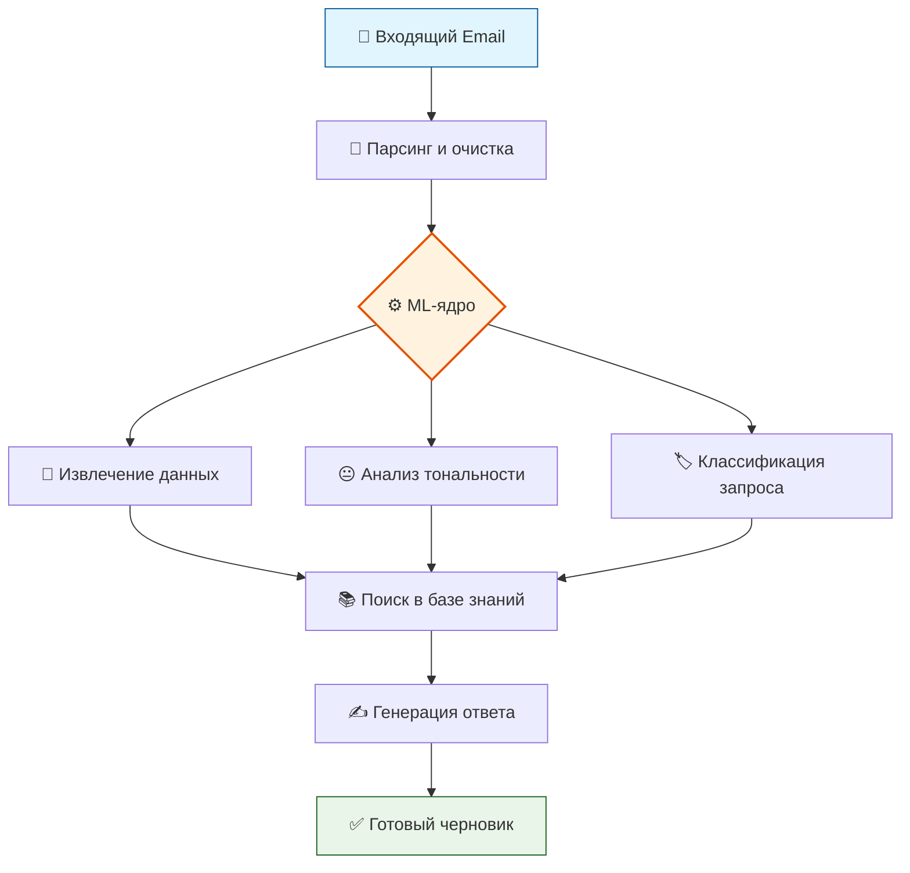

# 🧠 ENIGMA HACK — AI-агент Технической Поддержки

### Автоматизация обработки писем | Структурирование данных | Интеллектуальные ответы

## 📌 О проекте

В рамках кейса **ENIGMA HACK** разрабатывается AI-агент для автоматизации обработки писем технической поддержки. Система анализирует входящие письма клиентов, автоматически извлекает ключевую информацию, определяет тип и тональность обращения, формирует запись в веб-таблице и подготавливает ответ на основе базы знаний (руководства, FAQ, история решений).

**Наше решение направлено на:**
*   Снижение нагрузки на операторов первой линии.
*   Кардинальное ускорение обработки обращений.
*   Структурирование неструктурированных данных для дальнейшей аналитики.

---

## 🎯 Цели проекта

1.  **Скорость:** Сократить время обработки писем техподдержки до 50%.
2.  **Структура:** Автоматизировать парсинг и классификацию неформальных писем.
3.  **Качество:** Повысить релевантность ответов за счет использования базы знаний (RAG).
4.  **Аналитика:** Создать базу для отслеживания повторяющихся проблем и узких мест.

## 👥 Наша команда

| Роль | Участник | Контакт |
| :--- | :--- | :--- |
| **Frontend** | Гагельганц Антон Владимирович | [@AVGJFD](https://t.me/AVGJFD) |
| **Backend** | Гошуренко Юрий Юрьевич | [@yures_sa](https://t.me/yures_sa) |
| **Дизайнер** | Леонова Елизавета Сергеевна | [@elisabeth_leonova](https://t.me/elisabeth_leonova) |
| **Аналитик** | Попов Андрей Вячеславович | [@Wnpks](https://t.me/Wnpks) |
| **ML** | Щавровская Полина Константиновна | [@shchavr](https://t.me/shchavr) |

---

### 🔗 ER-диаграмма, User Flow, дизайн В FIGMA

## 🔄 Пользовательский сценарий (User Flow)

Как работает система от получения письма до ответа клиенту.

1.  **📧 Отправка:** Клиент отправляет письмо в техподдержку.
2.  **📥 Получение:** Письмо автоматически поступает в систему через Email API (IMAP).
3.  **🤖 Обработка AI-агентом:**
    *   Парсинг и извлечение сущностей (ФИО, серийные номера, приборы).
    *   Анализ тональности (позитив/негатив/нейтрал).
    *   Классификация типа запроса (неисправность/калибровка и т.д.).
    *   Поиск релевантной информации в базе знаний (руководства, FAQ).
    *   Генерация черновика ответа с использованием найденного контекста (RAG).
4.  **📊 Заполнение таблицы:** Веб-интерфейс (таблица) автоматически обновляется данными из письма.
5.  **👨‍💻 Ответ пользователю ** API отправляет сообщениею пользователю.

---

## 🔄 Логика работы AI-агента

### ML-пайплайн

Визуализация процесса обработки письма от получения до генерации ответа:

## 🤖 Функции AI-агента

*   **🔍 Парсинг писем:** Автоматическое извлечение ФИО, контактов, серийных номеров, типа прибора и сути вопроса.
*   **😐 Анализ эмоционального окраса:** Определение тональности письма (позитивная / нейтральная / негативная) для эскалации сложных случаев.
*   **📂 Классификация запросов:** Отнесение письма к одной из категорий: `неисправность`, `калибровка`, `запрос документации`, `другое`.
*   **✍️ Генерация ответов:** Подготовка осмысленных черновиков ответов на основе найденной в базе знаний информации (RAG-подход).

---

## 📊 Структура веб-таблицы

Данные, автоматически заполняемые в интерфейсе оператора:

| Поле | Описание | Пример |
| :--- | :--- | :--- |
| **Дата** | Дата и время поступления письма | `12.10.2023, 14:23` |
| **ФИО** | Отправитель обращения | `Иванов Иван Иванович` |
| **Объект** | Организация / объект клиента | `ООО "Ромашка", Цех №3` |
| **Телефон** | Контактный номер | `+7 (900) 123-45-67` |
| **Email** | Почта отправителя | `ivanov@example.com` |
| **Заводские номера** | Номера приборов | `SN-12345, SN-67890` |
| **Тип приборов** | Модель / тип оборудования | `Анализатор Спектра-М` |
| **Эмоциональный окрас** | Тональность письма | 🟢 Позитивный / 🟡 Нейтральный / 🔴 Негативный |
| **Суть вопроса** | Краткое описание проблемы | `Прибор не включается после скачка напряжения` |
| **Категория** | Тип обращения | `Неисправность` |
| **Статус** | Текущий статус в системе | `Новое / В работе / Закрыто` |

---

## 🛠 Технологический стек

*   **Backend:** Python (FastAPI)
*   **ML / NLP:** Hugging Face Transformers (BERT / RoBERTa), RAG
*   **База данных:** PostgreSQL
*   **Web-интерфейс:** Vue.js
*   **Email:** IMAP / SMTP
*   **Контейнеризация:** Docker, docker-compose

---

## ⚠️ Риски и митигация

| Риск | Стратегия митигации |
| :--- | :--- |
| Недостаток размеченных данных для обучения | Использование Zero-shot классификации и rule-based подходов на старте. |
| Ошибки генерации ответов (галлюцинации) | Применение RAG (поиск по базе знаний) + строгие промпты для LLM. |
| Ошибки извлечения данных из писем | Комбинирование Regex-шаблонов с ML, наличие fallback-логики. |
| Ограниченное время хакатона | Жесткий фокус на MVP, модульная архитектура для параллельной разработки. |

---

> **🔗 Ссылка на Figma (ER-диаграмма, User Flow, Дизайн):** [https://www.figma.com/design/fsDGXbYVIP8JVttjrY7zjr/Хак?node-id=0-1&p=f&t=xb88eTvoWwWc5fn3-0](https://www.figma.com/design/fsDGXbYVIP8JVttjrY7zjr/Хак?node-id=0-1&p=f&t=xb88eTvoWwWc5fn3-0)
