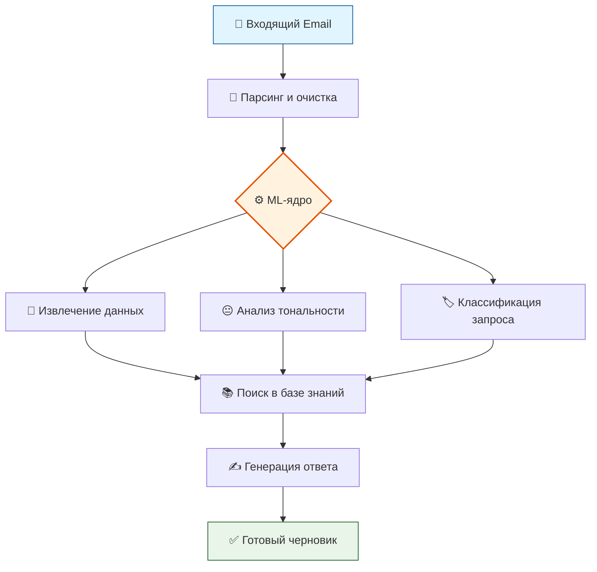

# 🧠 ENIGMA HACK — AI-агент Технической Поддержки

### Автоматизация обработки писем | Структурирование данных | Интеллектуальные ответы

## 📌 О проекте

В рамках кейса **ENIGMA HACK** разрабатывается AI-агент для автоматизации обработки писем технической поддержки. Система анализирует входящие письма клиентов, автоматически извлекает ключевую информацию, определяет тип и тональность обращения, формирует запись в веб-таблице и подготавливает ответ на основе базы знаний (руководства, FAQ, история решений).

**Наше решение направлено на:**
*   Снижение нагрузки на операторов первой линии.
*   Кардинальное ускорение обработки обращений.
*   Структурирование неструктурированных данных для дальнейшей аналитики.

---

### 🎨 НАША ФИГМА

**📑 Первая страница — Дизайн интерфейса**  
**📊 Вторая страница — User Flow и ER-диаграмма**

---

## 🏗️ Текущая архитектура системы

На текущем этапе реализована базовая инфраструктура для обработки входящих обращений:

### 📥 Процессинг писем
- Система подключается к почтовому ящику через **IMAP** и скачивает непрочитанные сообщения
- Письма декодируются с учётом **MIME-заголовков** (поддержка разных кодировок и вложений)
- Тело письма сохраняется в таблицу `emails` с временной меткой и статусом `received`

### 🗄️ Структура данных
- Для каждого письма создаётся тикет в таблице `support_tickets`
- Автоматически заполняются структурированные поля: имя, компания, категория, тональность, краткое описание
- Результаты работы ML-моделей сохраняются в таблице `ml_requests` для дальнейшего анализа и дообучения
- Тикет создаётся со статусом `new`

### 🚀 API endpoints
- **Авторизация:** вход пользователей в систему
- **Просмотр:** получение списков писем и тикетов
- Базовая функциональность для взаимодействия с системой через API

### 🐳 Docker-инфраструктура

Для упрощения развертывания и изоляции компонентов используется Docker:

| Контейнер | Технологии | Назначение |
|:----------|:-----------|:-----------|
| **Frontend** | Vue.js + Nginx | Собранное SPA-приложение, обслуживаемое через Nginx |
| **Backend** | FastAPI + PostgreSQL | Основная логика, ML-обработка, работа с БД |

**✨ Особенности:**
- Совместное взаимодействие контейнеров через `docker-compose`
- Проксирование запросов через Nginx
- Единая сеть для связи компонентов
- Запуск одной командой: `docker-compose up`

---

## 🎯 Цели проекта

1.  **Скорость:** Сократить время обработки писем техподдержки до 50%.
2.  **Структура:** Автоматизировать парсинг и классификацию неформальных писем.
3.  **Качество:** Повысить релевантность ответов за счет использования базы знаний (RAG).
4.  **Аналитика:** Создать базу для отслеживания повторяющихся проблем и узких мест.

---

## 👥 Наша команда

| Роль | Участник | Контакт |
| :--- | :--- | :--- |
| **Frontend** | Гагельганц Антон Владимирович | [@AVGJFD](https://t.me/AVGJFD) |
| **Backend** | Гошуренко Юрий Юрьевич | [@yures_sa](https://t.me/yures_sa) |
| **Дизайнер** | Леонова Елизавета Сергеевна | [@elisabeth_leonova](https://t.me/elisabeth_leonova) |
| **Аналитик** | Попов Андрей Вячеславович | [@Wnpks](https://t.me/Wnpks) |
| **ML** | Щавровская Полина Константиновна | [@shchavr](https://t.me/shchavr) |

---

## 🔄 Пользовательский сценарий (User Flow)

Как работает система от получения письма до ответа клиенту.

1.  **📧 Отправка:** Клиент отправляет письмо в техподдержку.
2.  **📥 Получение:** Письмо автоматически поступает в систему через Email API (IMAP).
3.  **🤖 Обработка AI-агентом:**
    *   Парсинг и извлечение сущностей (ФИО, серийные номера, приборы)
    *   Анализ тональности (позитив/негатив/нейтрал)
    *   Классификация типа запроса (неисправность/калибровка и т.д.)
    *   Поиск релевантной информации в базе знаний (руководства, FAQ)
    *   Генерация черновика ответа с использованием найденного контекста (RAG)
4.  **📊 Заполнение таблицы:** Веб-интерфейс автоматически обновляется данными из письма
5.  **👨‍💻 Ответ пользователю:** API отправляет сообщение пользователю

> 💡 **Более подробный User Flow — в Figma!**

---

## 🔄 Логика работы AI-агента

### ML-пайплайн

Визуализация процесса обработки письма от получения до генерации ответа:

## 🤖 Функции AI-агента

*   **🔍 Парсинг писем:** Автоматическое извлечение ФИО, контактов, серийных номеров, типа прибора и сути вопроса.
*   **😐 Анализ эмоционального окраса:** Определение тональности письма (позитивная / нейтральная / негативная) для эскалации сложных случаев.
*   **📂 Классификация запросов:** Отнесение письма к одной из категорий: `неисправность`, `калибровка`, `запрос документации`, `другое`.
*   **✍️ Генерация ответов:** Подготовка осмысленных черновиков ответов на основе найденной в базе знаний информации (RAG-подход).

---

## 📊 Структура веб-таблицы

Данные, автоматически заполняемые в интерфейсе оператора:

| Поле | Описание | Пример |
| :--- | :--- | :--- |
| **Дата** | Дата и время поступления письма | `12.10.2023, 14:23` |
| **ФИО** | Отправитель обращения | `Иванов Иван Иванович` |
| **Объект** | Организация / объект клиента | `ООО "Ромашка", Цех №3` |
| **Телефон** | Контактный номер | `+7 (900) 123-45-67` |
| **Email** | Почта отправителя | `ivanov@example.com` |
| **Заводские номера** | Номера приборов | `SN-12345, SN-67890` |
| **Тип приборов** | Модель / тип оборудования | `Анализатор Спектра-М` |
| **Эмоциональный окрас** | Тональность письма | 🟢 Позитивный / 🟡 Нейтральный / 🔴 Негативный |
| **Суть вопроса** | Краткое описание проблемы | `Прибор не включается после скачка напряжения` |
| **Категория** | Тип обращения | `Неисправность` |
| **Статус** | Текущий статус в системе | `Новое / В работе / Закрыто` |

---

## 🛠 Технологический стек

*   **Backend:** Python (FastAPI)
*   **ML / NLP:** Hugging Face Transformers (BERT / RoBERTa), RAG
*   **База данных:** PostgreSQL
*   **Web-интерфейс:** Vue.js
*   **Email:** IMAP / SMTP
*   **Контейнеризация:** Docker, docker-compose

---

## 🚧 Статус реализации

| Статус | Компонент | Описание |
|:------:|:----------|:---------|
| ✅ **Реализовано** | Интеграция с почтой | Подключение через IMAP, скачивание непрочитанных писем |
| ✅ **Реализовано** | Обработка писем | Декодирование MIME-заголовков, сохранение тела письма |
| ✅ **Реализовано** | Тикеты | Создание тикетов со структурированными полями |
| ✅ **Реализовано** | ML-логи | Сохранение результатов ML в отдельную таблицу `ml_requests` |
| ✅ **Реализовано** | API | Базовые эндпоинты для авторизации и получения данных |
| ✅ **Реализовано** | Инфраструктура | Docker-контейнеризация с docker-compose |
| ⏳ **В разработке** | Автоответ | Автоматическая отправка ответов клиентам |
| ⏳ **В разработке** | Админ-панель | Операции для администраторов системы |
| ⏳ **В разработке** | Веб-интерфейс | Полноценный UI для операторов |

---

## ⚠️ Риски и стратегии митигации

### 🎯 Неверная интерпретация цели

| Риск | Последствия | Митигация |
|:-----|:------------|:----------|
| Цель звучит амбициозно, но не уточняется, что именно измеряется (время до первого ответа или общее время решения) | Формальное достижение цели при падении качества поддержки, недовольство клиентов | Четкое разделение метрик: TTFHR (время первого ответа) и FTR (время полного решения). Контроль качества ответов перед отправкой |

### 🔍 Низкое качество парсинга (извлечения сущностей)

| Риск | Последствия | Митигация |
|:-----|:------------|:----------|
| Пользователи пишут с ошибками, используют нестандартные форматы ("заводской номер: 123/456", "тел. 8 900..."). Модель может некорректно извлекать данные | Таблица заполняется неверными данными, требуется ручная коррекция, автоматизация теряет смысл | Комбинирование ML с Regex-шаблонами, fallback-логика, возможность ручного редактирования |

### 😡 Некорректная классификация тональности и типа запроса

| Риск | Последствия | Митигация |
|:-----|:------------|:----------|
| Сарказм, сложные технические описания или смешанные типы запросов могут быть неверно интерпретированы | Срочное негативное письмо может быть помечено как нейтральное и обработано в последнюю очередь → эскалация конфликта | Дообучение моделей на исторических данных, приоритизация писем с маркерами срочности |

### 📚 Неэффективность RAG-подхода

| Риск | Последствия | Митигация |
|:-----|:------------|:----------|
| Система не находит релевантный контекст (устаревшая документация, плохо структурированные FAQ) | Генерация галлюцинаций (вымышленных фактов), неверных советов, бесполезных ответов | Регулярное обновление базы знаний, validation layer перед отправкой, человеческий overeview |

### 🎨 "Паралич анализа" из-за дизайна

| Риск | Последствия | Митигация |
|:-----|:------------|:----------|
| Желание реализовать всё красиво (сложные статусы, цветовые индикаторы) отвлекает ресурсы от core-функциональности | Красивый интерфейс с "сырой" и медленной логикой обработки | MVP-подход: сначала работающая логика, потом визуальные улучшения |

---

## 🗄️ Схема базы данных

**Основные таблицы:**

| Таблица | Назначение |
|:--------|:-----------|
| `emails` | Сырые письма с метаданными |
| `support_tickets` | Структурированные обращения |
| `ml_requests` | Результаты работы ML-моделей |

> 🔗 **Подробная ER-диаграмма в Figma:** [тык](https://www.figma.com/design/fsDGXbYVIP8JVttjrY7zjr/Хак?node-id=0-1&p=f&t=xb88eTvoWwWc5fn3-0)
